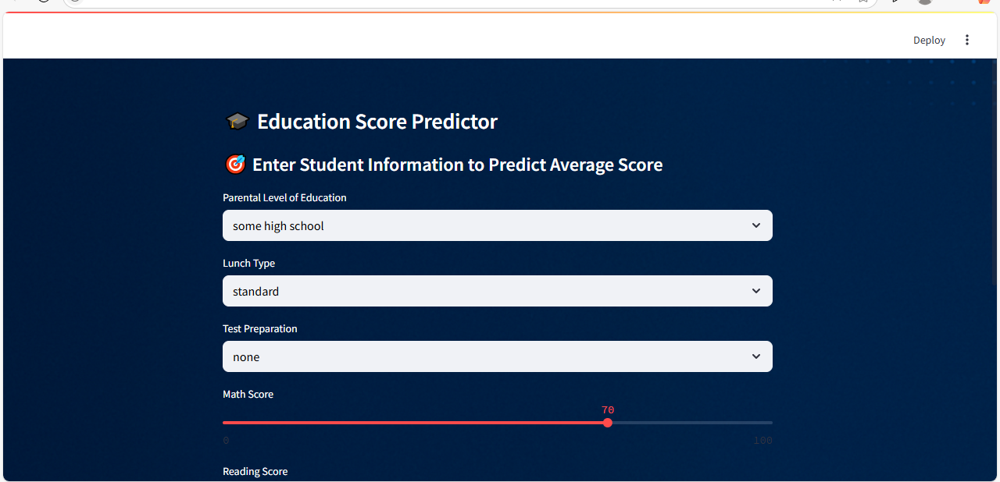
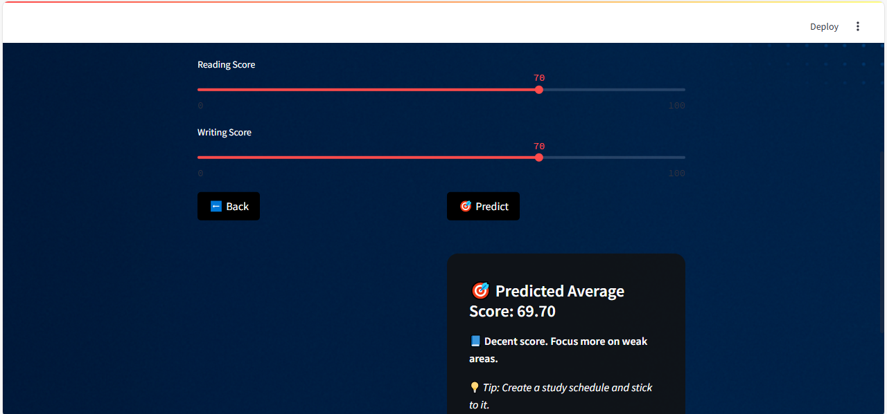
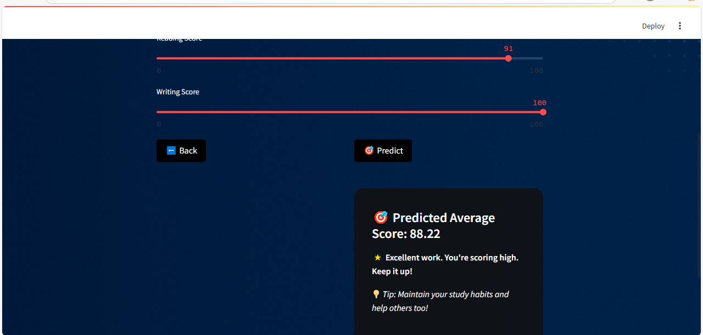
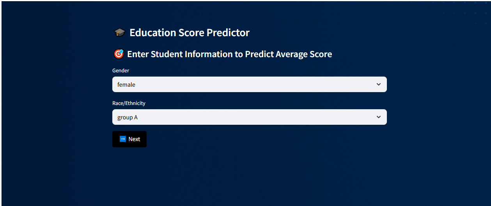

# EduScorePredictor
## Project Overview

This project is an end-to-end Machine Learning pipeline that predicts student performance based on various demographic and educational factors.

We followed the complete ML process:
- Data collection
- Exploratory Data Analysis (EDA)
- Preprocessing & Feature Engineering
- Model Training
- Model Deployment with GUI

This project was built for our university Special Topics course.

## Dataset

The dataset used is **Students Performance Dataset**, obtained from an open-source repository.  
It contains information about:
- Gender
- Race/Ethnicity
- Parental Level of Education
- Lunch
- Test Preparation Course
- Math Score
- Reading Score
- Writing Score

We performed preprocessing to clean and prepare this data for training.

## Project Structure
EduScorePredictor/
│
├── data/
│ ├── raw/
│ └── processed/
│
├── src/
│ ├── preprocess.py
│ ├── train_model.py
│ ├── gui_app.py
│ └── model.pkl
│
├── screenshots/
│ └── gui_prediction_results.png
│
├── eda_notebook.ipynb
├── dataset_intro.pdf
├── report.pdf
├── requirements.txt
├── README.md

## How to Run the Project

### 1️⃣ Clone the Repository

```bash
git clone https://github.com/binayee04/EduScorePredictor.git
cd EduScorePredictor
```

### 2️⃣ Install the Required Libraries

```bash
pip install -r requirements.txt
```

> 💡 Make sure you’re using Python 3.8+ for best compatibility.

### 3️⃣ Run the GUI App

```bash
python src/gui_app.py
```

### 4️⃣ View the EDA Notebook

You can open `eda_notebook.ipynb` using:

- Jupyter Notebook on your local machine, or  
- Google Colab: [https://colab.research.google.com](https://colab.research.google.com)

## 📸 Screenshots

Here are examples of our working GUI interface:

  
  
  



